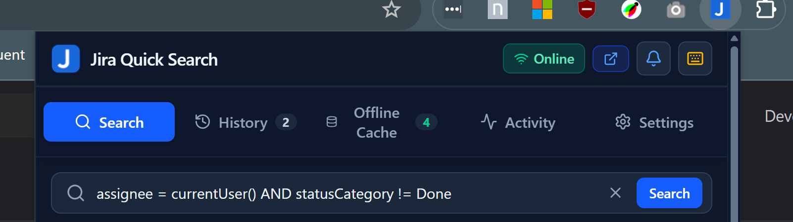
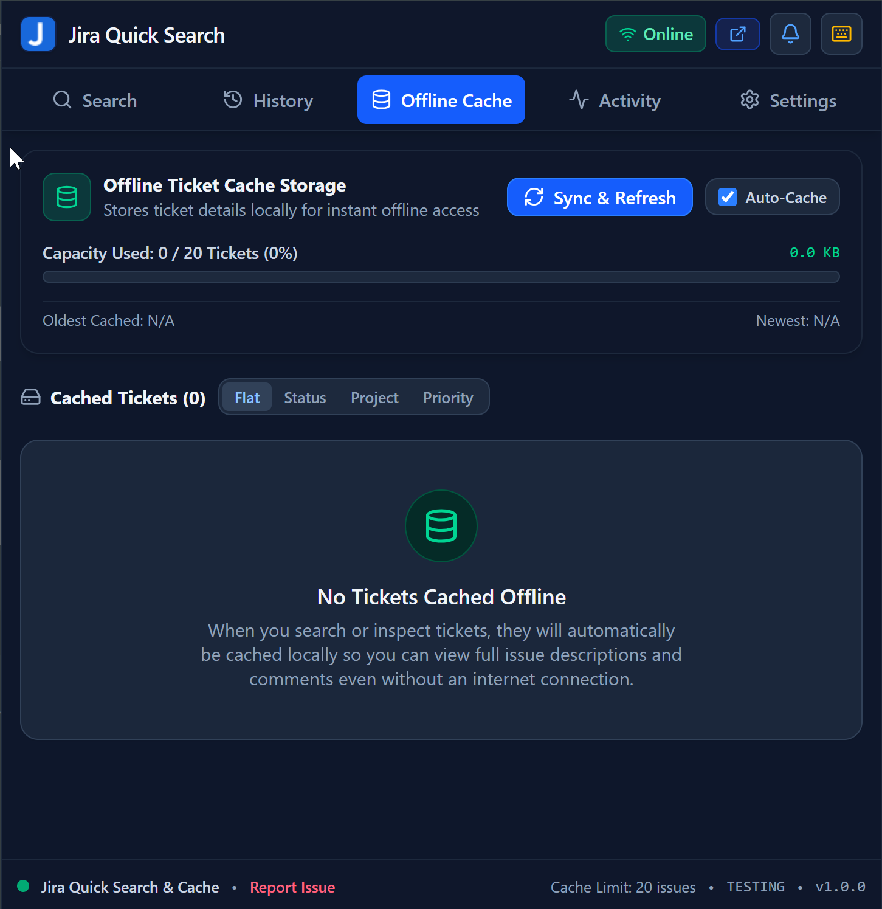
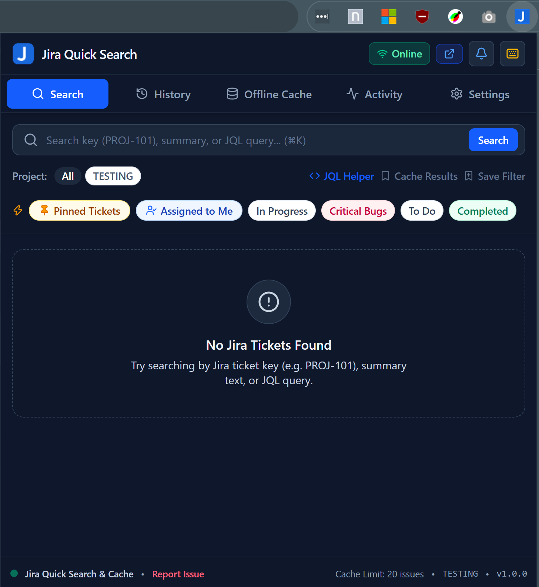
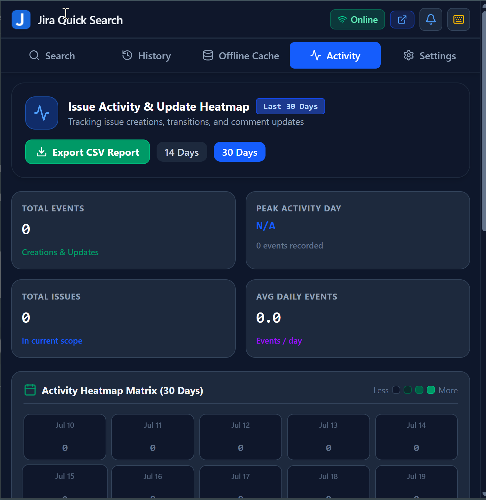
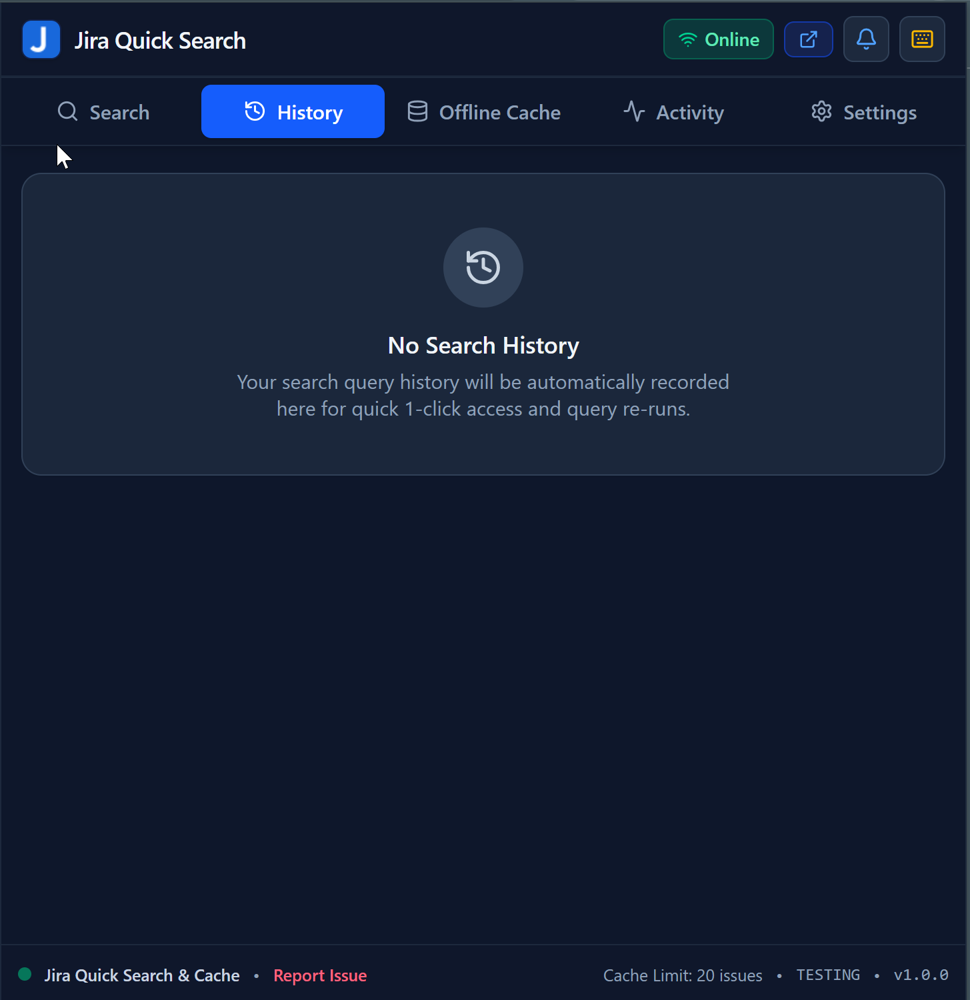
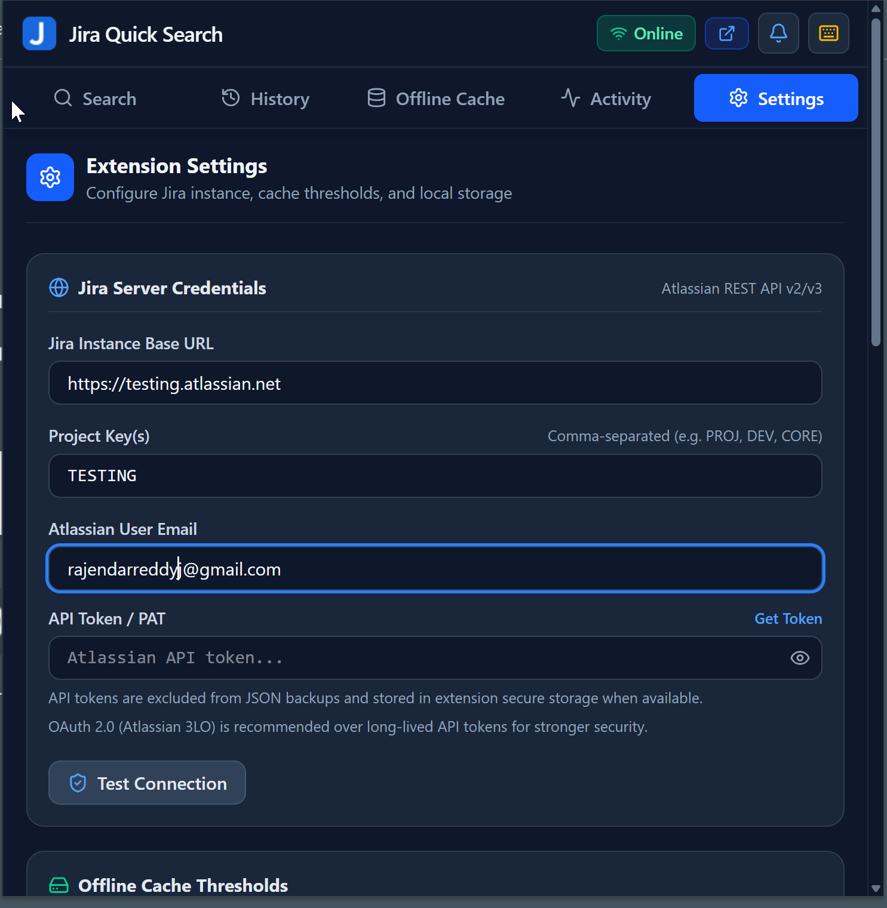

# Jira Quick Search - Chrome Extension & Web Application



**Jira Quick Search** is a fast, offline-capable Chrome Extension and Web Dashboard designed for engineering teams and managers to instantly search, inspect, cache, watch, and transition Jira issues without waiting for Jira's slow web interface to load.



## 🖼️ Latest UI Screenshots

### Search Experience



### Activity Dashboard



### Offline Cache Manager


### Search History



### Settings & Security



---

## 🌟 Key Features

- ⚡ **Instant Search & JQL Autocomplete**: Search by issue key (`PROJ-101`), summary, assignee, or JQL query expressions with real-time autocompletion for recent fragments, operators, and issue key prefixes.
- 🏷️ **Quick Filter Chips**: Filter currently loaded tickets instantly by `My Issues`, `High Priority`, `In Progress`, `Done`, or `Unassigned` without triggering additional network requests.
- 🔗 **Open in New Tab**: Open any issue directly from the search result row in a new browser tab with extension-safe `chrome.tabs.create` fallback behavior.
- ⏱️ **Time Tracking Progress Bar**: Displays original estimate, logged time spent, and remaining hours formatted into a color-coded visual progress bar in the ticket detail modal.
- 💾 **Smart Offline Cache & Grouping**: Cache opened tickets with configurable limits, stale-cache cleanup, CSV export, and grouping by **Status**, **Project**, or **Priority**.
- ✅ **Auto-Cache Controlled Search Caching**: Search result caching is only active when **Auto-Cache Searched Tickets** is enabled in Settings.
- 🔄 **15-Minute Auto-Refresh**: Background periodic auto-refresh keeps offline cached tickets synced with the latest updates on Jira Cloud.
- 📑 **Interactive Labels & Tags**: Click any issue label tag in the detail view to instantly filter the issue list by `labels = "label_name"`.
- 🖨️ **Print to PDF View**: Clean, print-formatted document modal tailored for physical printing or saving ticket details directly as PDF.
- 📋 **Copy JQL String to Clipboard**: Easily copy full JQL query strings from search history with one click to reuse complex queries in Jira Cloud.
- 🔐 **Secure Credential Handling**: Jira credentials are stored in extension secure storage (`chrome.storage.local`) when available and not persisted in plain settings payloads.
- 📤 **Settings JSON Export / Import**: Backups include settings and search history, but API token fields are always excluded/ignored for security.
- 👁️ **Ticket Watching & Pin Alerts**: Watch and pin critical tickets to receive status change and comment update notifications.
- 📝 **Markdown & Subtasks**: Full GitHub Flavored Markdown support for Jira descriptions and comments, plus inline subtask progress tracking.
- 🌙 **Dark Theme Optimized UI**: Consistent dark UI shell, cards, and result states optimized for extension popup readability.
- 🤖 **CI/CD GitHub Actions**: Includes automated workflows for linting on every commit and automated release packaging on tag creation.

---

## 📐 System Architecture Diagram

```
┌──────────────────────────────────────────────────────────────────────────────┐
│               CHROME EXTENSION (MANIFEST V3) ARCHITECTURE                   │
│                           & CI/CD PIPELINE                                   │
└──────────────────────────────────────────────────────────────────────────────┘

[1] USER INTERFACE LAYER (Chrome Popup / Side Panel)
┌ React 18 + Vite + Tailwind CSS
├ Global Keyboard Navigation Engine (⌘K, ↑/↓, Enter)
├ Recharts Analytics & Priority Badging Components
└ Popup screens: SearchPanel, IssueList, IssueDetailModal, SettingsModal

│ ▼ IPC / direct service calls

[2] LOCAL STORAGE & CACHE ENGINE
┌ Secure credentials in Chrome extension storage (`chrome.storage.local` when available)
├ Ticket caching engine (configurable limit)
├ Cache sources: history, watched issues, settings, saved searches
└ Offline Fallback Provider (serves cached results seamlessly)

│ ▼ REST API proxy

[3] EXTERNAL JIRA REST API INTEGRATION
┌ Jira Cloud REST API v3 / JQL endpoint
├ Authentication: Jira API token (with secure local storage separation)
├ Background refresh loop (15-minute interval)
└ Issue operations: search, fetch details, watch, transition, comments

│ ▼ CI/CD automated deployment

[4] GITHUB ACTIONS RELEASE PIPELINE
┌ Push/Tag trigger (git tag v1.0.0)
├ Automated lint + Vite production bundle
├ ZIP extension artifact packaging
├ GitHub Release creation with release notes
└ Direct upload and publish to Google Chrome Web Store API
```

---

## 🤖 GitHub Actions CI/CD

The repository includes pre-configured GitHub Actions workflows located in `.github/workflows/`:

1. **Linting Workflow** (`.github/workflows/lint.yml`):
   - Triggers automatically on every `push` and `pull_request` to `main` or `master`.
   - Runs `npm run lint` to enforce code quality and TypeScript safety.

2. **Build + Publish Workflow** (`.github/workflows/chrome-extension.yml`):
   - On `main` push: bumps patch version, commits version files, and pushes a `v*` tag.
   - On tag push (`v*`): builds production output, zips **dist only**, creates GitHub release, and publishes to Chrome Web Store.

---

## 🛠️ Development & Building

### Prerequisites

- Node.js 18+
- npm or bun

### Local Commands

```bash
# Install dependencies
npm install

# Start local dev server (port 3000)
npm run dev

# Run TypeScript linter
npm run lint

# Build production distribution
npm run build
```

---

## 🚀 How to Publish as a Chrome Extension

### 0. Automatic Versioning & Release Creation

Current release flow:

1. Push to `main`.
2. Workflow auto-bumps patch version and pushes a `v*` tag.
3. Tag-triggered publish job packages `dist` and publishes.

You can still trigger release manually by pushing a version tag formatted like `v1.0.0`.

```bash
git tag -a v1.0.0 -m "Release v1.0.0"
git push origin v1.0.0
```

### 1. Chrome Web Store API Secret Keys Setup

In your GitHub repository settings under **Secrets and variables → Actions**, add the following secrets:

- `CHROME_EXTENSION_ID`: Your extension ID from Chrome Developer Dashboard
- `CHROME_CLIENT_ID`: Google Cloud OAuth2 Client ID
- `CHROME_CLIENT_SECRET`: Google Cloud OAuth2 Client Secret
- `CHROME_REFRESH_TOKEN`: OAuth2 Refresh Token for Chrome Web Store API

#### How to get each value

1. **Get `CHROME_EXTENSION_ID`**
   - Open [Chrome Web Store Developer Dashboard](https://chrome.google.com/webstore/devconsole/).
   - Open your extension listing.
   - Copy the **Item ID** (also visible in the listing URL).
   - Save it as `CHROME_EXTENSION_ID` in GitHub Actions secrets.

2. **Get `CHROME_CLIENT_ID` and `CHROME_CLIENT_SECRET`**
   - Open [Google Cloud Console](https://console.cloud.google.com/).
   - Create/select a project.
   - Enable **Chrome Web Store API**.
   - Configure **OAuth consent screen**.
   - Go to **APIs & Services → Credentials** and create an **OAuth client ID**.
   - Copy values from the created credential:
     - Client ID → `CHROME_CLIENT_ID`
     - Client Secret → `CHROME_CLIENT_SECRET`

3. **Get `CHROME_REFRESH_TOKEN`**
   - Generate a refresh token for the same OAuth client with Chrome Web Store API scope.
   - Save it as `CHROME_REFRESH_TOKEN` in GitHub Actions secrets.

4. **Add all four secrets to GitHub**
   - Repository → **Settings** → **Secrets and variables** → **Actions** → **New repository secret**.
   - Add: `CHROME_EXTENSION_ID`, `CHROME_CLIENT_ID`, `CHROME_CLIENT_SECRET`, `CHROME_REFRESH_TOKEN`.

### 2. Build the Extension Bundle

Run the build script to compile static HTML, CSS, and JS assets into the `dist` directory:

```bash
npm run build
```

### 3. Verify `manifest.json` Setup

Ensure the root `dist/manifest.json` file is present (or copy from `assets/manifest.json`). The extension uses Manifest V3:

```json
{
  "manifest_version": 3,
  "name": "Jira QuickSearch",
  "version": "1.0.0",
  "description": "Fast offline Jira search, ticket watching, caching, and bulk issue status management.",
  "action": {
    "default_popup": "index.html",
    "default_icon": {
      "16": "icons/icon16.png",
      "48": "icons/icon48.png",
      "128": "icons/icon128.png"
    }
  },
  "permissions": ["storage", "clipboardWrite"],
  "host_permissions": ["https://*.atlassian.net/*"]
}
```

### 4. Manual Local Build & Testing

To test the extension locally in Chrome:

1. Run `npm run build` locally.
2. Open Chrome and navigate to `chrome://extensions`.
3. Enable **Developer Mode** in the top right toggle.
4. Click **Load unpacked** and select the generated `dist/` directory.

### 5. Load & Test Unpacked Extension locally

1. Open Google Chrome and navigate to `chrome://extensions/`.
2. Toggle **Developer mode** in the top right corner.
3. Click **Load unpacked**.
4. Select the build output directory (`dist`).
5. Open the Extension Popup from your Chrome toolbar and test Jira connection in Settings.

### 6. Publish to the Chrome Web Store

1. **Create Developer Account**: Sign in to the [Chrome Web Store Developer Console](https://chrome.google.com/webstore/devconsole/).
2. **Zip Distribution Output**: Compress the contents of the `dist` folder into a ZIP file:

   ```bash
   cd dist && zip -r ../jira-quicksearch-v1.0.0.zip .
   ```

3. **Upload Package**: Click **New Item** in the Chrome Web Store Console and upload `jira-quicksearch-v1.0.0.zip`.
4. **Store Listing Details**:
   - Title: Jira Quick Search
   - Short Description: Search, cache, watch, and transition Jira issues instantly.
   - Upload 128x128 icon and at least one 1280x800 screenshot.
   - Set Privacy Policy URL and Host Permissions Justification (`https://*.atlassian.net/*` for API access).
5. **Submit for Review**: Click **Submit for Review**. Review typically completes within 24 to 48 hours.

---

## 📄 License

MIT License. Built with React 18, Vite, Tailwind CSS, and Lucide Icons.
